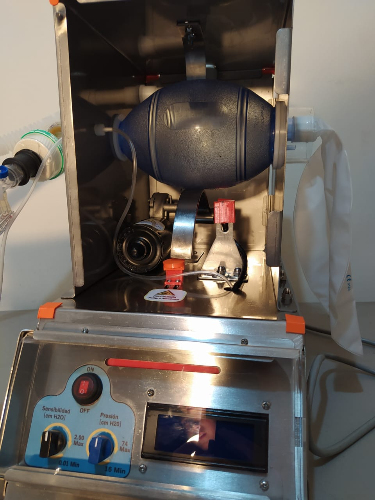
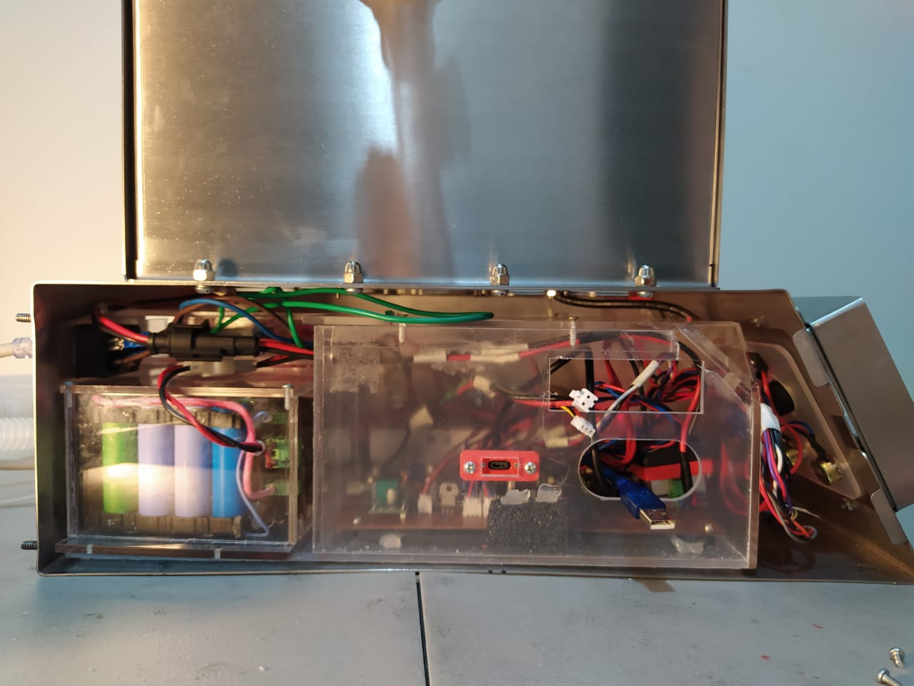
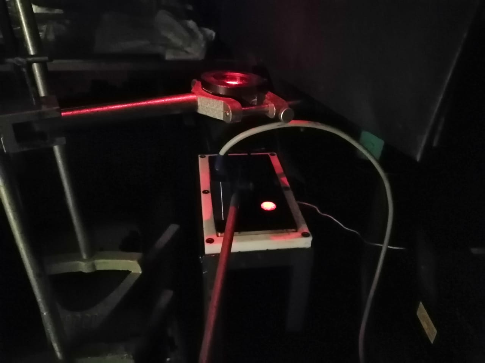
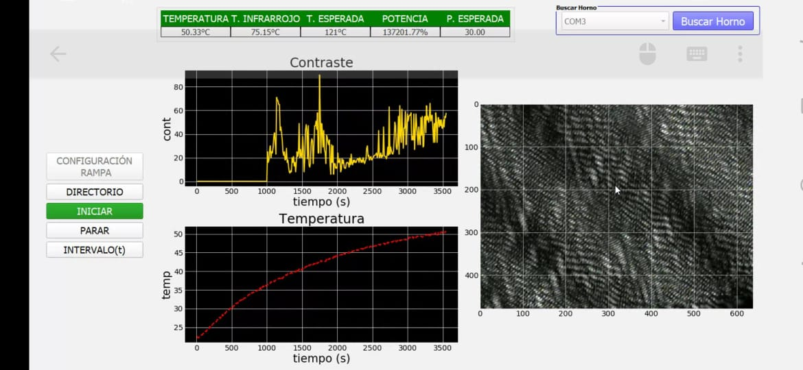

# Hi there 👋

## About Me
Hey there! I'm Maribel, an experienced electronic engineer with over 6 years of hands-on experience in both hardware and software engineering. I'm deeply passionate about tackling challenging projects and crafting innovative solutions to overcome obstacles.

## My Expertise
My journey in the field of electronic engineering has equipped me with a diverse skill set, enabling me to excel in various domains. Whether it's designing robust hardware systems or developing efficient software solutions, I thrive on the opportunity to push the boundaries of technology.

## Projects
Here's a glimpse into some of the remarkable projects I've been fortunate to be a part of:

### Eira Respiratory Equipment (Dinntec - Colombia)
- Description
Eira is a revolutionary project aimed at addressing the shortage of respiratory equipment, particularly during the COVID-19 pandemic. Inspired by the global collaboration among engineers to develop makeshift respiratory devices using local resources, Eira goes a step further by combining both hardware and software solutions to create effective respiratory equipment.

- Motivation
The motivation behind Eira stems from the pressing need to provide life-saving equipment to those affected by COVID-19, especially in regions facing shortages due to logistical challenges in importing devices. The project draws inspiration from the spirit of innovation and solidarity displayed by engineers worldwide during the crisis.

- Objectives
  - Hardware Development: Designing robust and efficient respiratory equipment using locally available materials and technologies.
  - Software Integration: Developing intuitive software interfaces to complement the hardware, ensuring ease of use and precise control.
  - Accessibility: Ensuring that the final product is accessible to healthcare facilities and communities, particularly in regions with limited resources.
  - Reliability and Safety: Prioritizing the safety and reliability of the equipment to meet medical standards and ensure patient well-being.

- Key Features
  - Custom Hardware: Tailored respiratory equipment designed to be effective and affordable.
  - Intuitive Software: User-friendly interfaces for seamless control and monitoring.
  - Local Sourcing: Utilizing readily available materials and technologies to facilitate widespread adoption.
  - Scalability: Designs scalable to meet varying demands and resource constraints.
  - Collaborative Development: Embracing a collaborative approach to innovation and knowledge-sharing.

- Impact
The impact of Eira extends beyond immediate crisis response. By empowering local communities with the tools to manufacture respiratory equipment, the project contributes to long-term healthcare resilience. Furthermore, it serves as a testament to the power of collaboration and ingenuity in addressing global challenges.

### - Images

## Heat Equipment (Dinntec - Colombia)
- Description: A series of equipment designed for the study of heat transfer in various systems. The equipment allows for the investigation of heat transfer in linear and radial metals, radiation heat transfer, and heat transfer in extended surfaces. Each piece of equipment is equipped with a computerized system that collects data from temperature sensors and controls furnace temperature to maintain the desired level. The software enables parameter adjustments for experiments, visualization of sensor readings, and USB communication with a PC for data storage. The compact design of the equipment facilitates easy placement in limited spaces.

- Implementation:
I designed and developed an HMI interface for conducting heat propagation studies. This interface allows for temperature control and records accurate readings of power, temperature, and data from various sensors, including infrared sensors, a radiometer, and a luxometer. Additionally, it generates graphs illustrating sensor readings over time, providing a comprehensive tool for thermal propagation analysis. In addition, I was also involved in the design of the electronic circuit using EagleCad and the development of the software to control it with Arduino.

### Images

## Speckle Interferometry Control and Analysis Software
- Description: Software developed to control and analyze hardware within the context of Speckle interferometry, an optical technique used to detect patterns on irregular surfaces. The software allows interaction with hardware, controlling the necessary devices for measurements and obtaining real-time data.

- Key Features:
  - Hardware Control: The software provides an interface to control the devices required for Speckle interferometry, facilitating system setup and operation.
  - Real-time Analysis: It enables visualization of graphs in real-time, providing instant feedback during the measurement process.
  - Data Processing: Includes tools for processing acquired images, allowing for pattern and surface variation determination.
  - Curing Moment Monitoring: Facilitates the detection of material curing moments through analysis of the acquired data.

### Contribution:
I actively participated in the development of both the software for controlling the hardware and the software for analyzing Speckle interferometry data. My contribution focused on implementing the user interface, image processing, and integrating functions for real-time monitoring.

This software is valuable for researchers and professionals working in the field of material characterization and curing processes. Its open-source nature facilitates adaptation and continuous improvement.

This project was also developed by
  - [Guillermo Alonso Guirales Arredondo]
  - [Yony Andres Benitez]

## Images

Get in Touch
I'm always open to collaboration, discussions, and feedback! If you have any questions, suggestions, or just want to connect, feel free to reach out to me. Let's create something extraordinary together!

Thank you for visiting my GitHub repository. Enjoy exploring!
